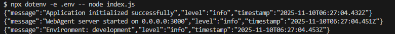
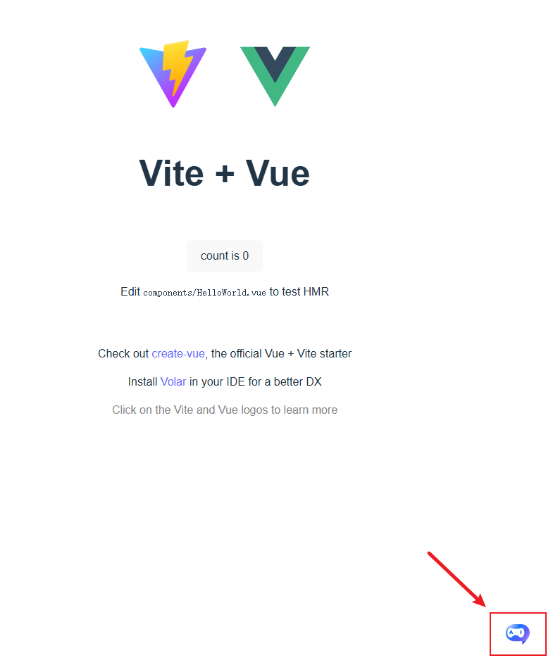
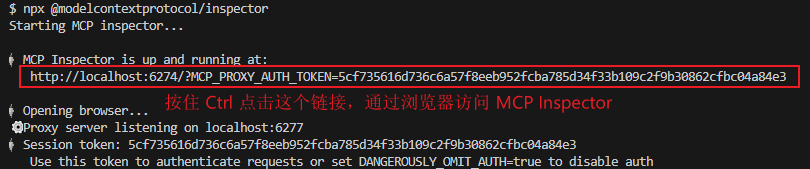
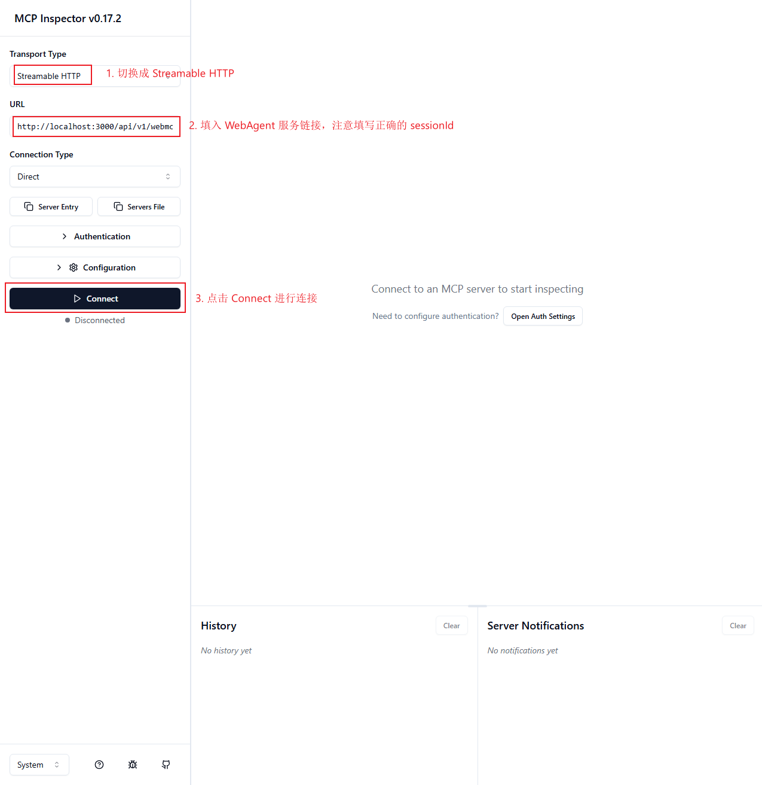
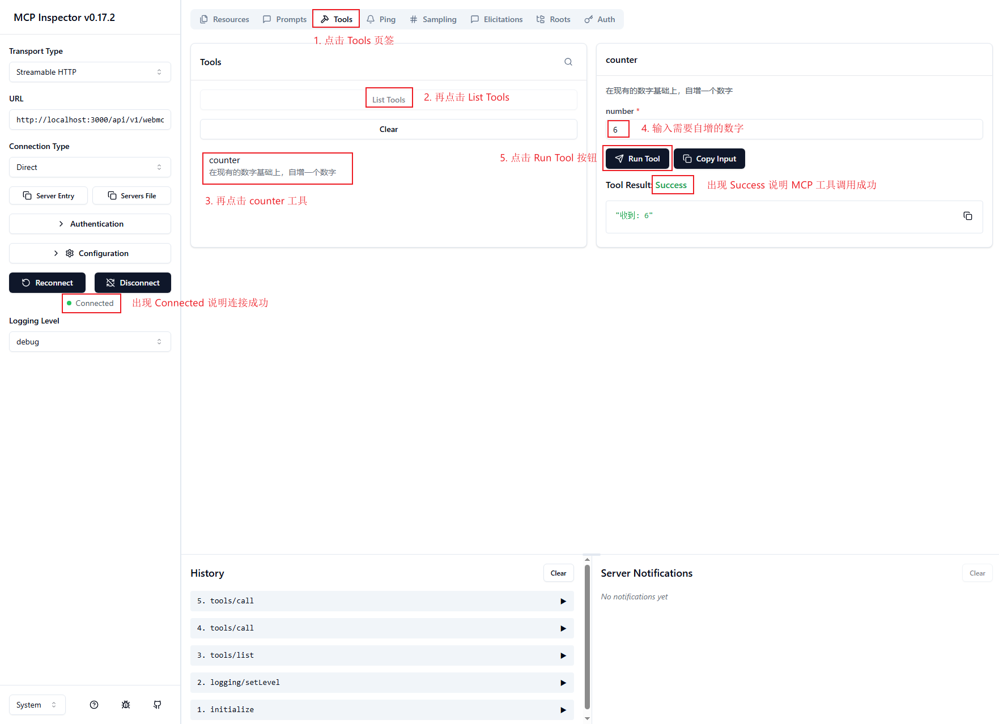
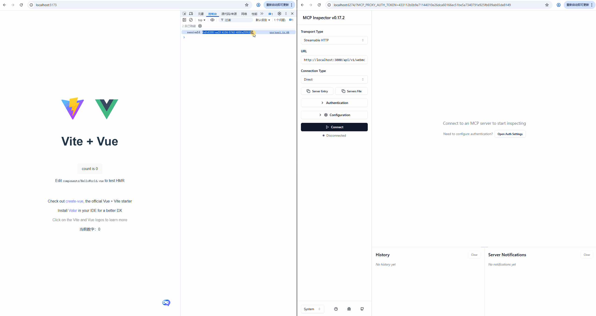
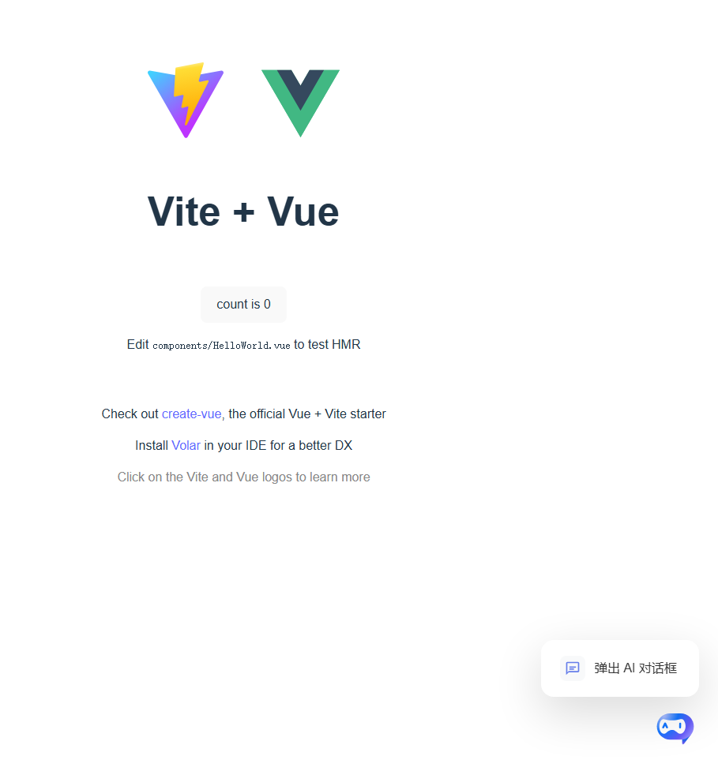
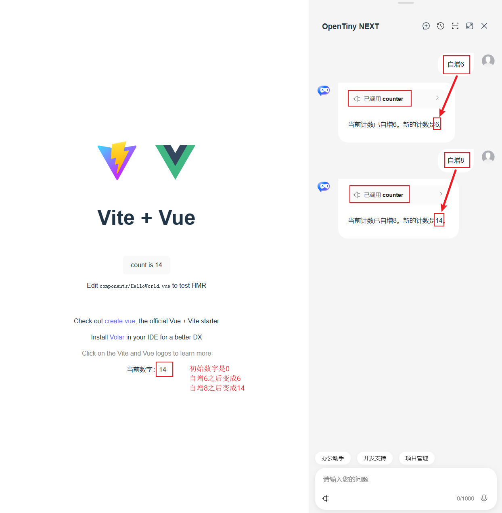
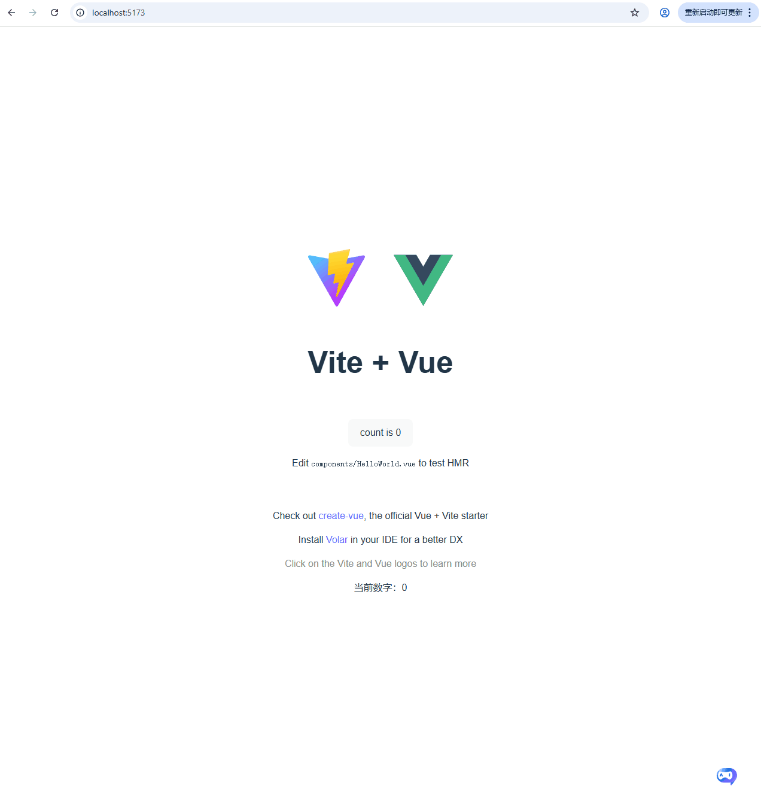
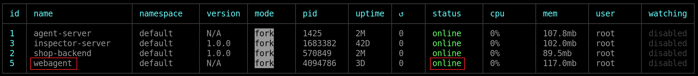

# WebAgent 私有化部署用户指导书

本指导书旨在帮助用户完成 WebAgent 私有化部署软件包的本地启动、Web 应用集成以及线上部署等操作。所提供的软件包为 zip 格式，例如：`webagent-private-deployment-v1.0.0-20251106_202724.zip`。

目录：
- [1 本地开发](#_1-本地开发)
  - [1.1 启动 WebAgent 服务](#_1-1-启动-webagent-服务)
    - [1.1.1 解压软件包](#_1-1-1-解压软件包)
    - [1.1.2 配置环境变量](#_1-1-2-配置环境变量)
    - [1.1.3 启动服务](#_1-1-3-启动服务)
  - [1.2 Web 应用智能化集成](#_1-2-web-应用智能化集成)
    - [1.2.1 安装依赖](#_1-2-1-安装依赖)
    - [1.2.2 定义 MCP Server，并连接 WebAgent](#_1-2-2-定义-mcp-server-并连接-webagent)
  - [1.3 本地调试](#_1-3-本地调试)
    - [1.3.1 使用 MCP Inspector 调试](#_1-3-1-使用-mcp-inspector-调试)
    - [1.3.2 使用 NEXT Remoter 组件调试](#_1-3-2-使用-next-remoter-组件进行调试)
- [2 线上部署](#_2-线上部署)
  - [2.1 安装 pm2](#_2-1-安装-pm2)
  - [2.2 解压软件包](#_2-2-解压软件包)
  - [2.3 配置环境变量](#_2-3-配置环境变量)
  - [2.4 启动 WebAgent 服务](#_2-4-启动-webagent-服务)
  - [2.5 配置 Nginx 反向代理](#_2-5-配置-nginx-反向代理)
  - [2.6 修改前端配置](#_2-6-修改前端配置)

## 1 本地开发

本文以 Windows 操作系统为例，使用 Git Bash 命令行工具进行说明。Node.js 版本需满足 ≥ **22.0.0**，可通过以下命令确认版本：

```shell
node -v
```

如版本不符合要求，请前往 [Node.js 官网](https://nodejs.org/zh-cn/download) 下载并安装符合要求的版本。

### 1.1 启动 WebAgent 服务

#### 1.1.1 解压软件包

请将 zip 压缩包解压至本地目录，例如：webagent-private-deployment，并进入该目录：

```shell
cd webagent-private-deployment
```

#### 1.1.2 配置环境变量

复制环境变量模板文件：

```shell
cp example.env .env
```

编辑 `.env` 文件，修改如下内容：

```diff
-CORS_ORIGIN=http://localhost:3000
+CORS_ORIGIN=http://localhost:5173
```

> 注：<br>
> 1. 减号(-)后面的内容是需要删除的，加号(+)后面的内容是需要增加的。<br>
> 2. `http://localhost:5173` 为本地前端应用的访问地址。<br>

#### 1.1.3 启动服务

首先安装 `dotenv-cli` 工具：

```shell
npm i -g dotenv-cli
```

然后执行以下命令启动 WebAgent 服务：

```shell
npx dotenv -e .env -- node index.js
```

若控制台输出如下信息，表示服务启动成功：



> 注意：WebAgent 服务需保持运行状态，请勿关闭终端窗口。若已安装 pm2，也可使用以下命令在后台运行：

```shell
pm2 start index.js --name webagent --env production
```

### 1.2 Web 应用智能化集成

以基于 Vite + Vue 构建的前端项目为例（可通过 `npm create vite my-project` 创建），需集成 NEXT-SDKs 并连接 WebAgent 服务。

#### 1.2.1 安装依赖

在项目目录下执行以下命令安装所需依赖：

```shell
npm i @opentiny/next-sdk @opentiny/next-remoter
```

#### 1.2.2 定义 MCP Server 并连接 WebAgent

在应用的主入口文件（比如：`src/App.vue`）中添加如下代码：

> 注意：START 和 END 标识中间的内容是需要增加的。

```html
<script setup lang="ts">
import HelloWorld from './components/HelloWorld.vue'

// START: 新增内容
import { onMounted, ref } from 'vue'
import { WebMcpServer, createMessageChannelPairTransport, z, WebMcpClient } from '@opentiny/next-sdk'
import { TinyRemoter } from '@opentiny/next-remoter'
import '@opentiny/next-remoter/dist/style.css'

const sessionId = ref('')
const numberValue = ref(0)
onMounted(async () => {
  // 创建 WebMcpServer ，并与 ServerTransport 连接
  const [serverTransport, clientTransport] = createMessageChannelPairTransport()

  const server = new WebMcpServer()

  server.registerTool(
    'counter',
    {
      title: '自增一个数字',
      description: '在现有数字基础上自增一个数值',
      inputSchema: { number: z.number() }
    },
    async ({ number }) => {
      console.log('number:', number)
      numberValue.value += number
      return { content: [{ type: 'text', text: `收到: ${numberValue.value}` }] }
    }
  )

  await server.connect(serverTransport)

  // 创建 WebMcpClient ，并与 WebAgent 连接
  const client = new WebMcpClient()
  await client.connect(clientTransport)
  const { sessionId: sessionID } = await client.connect({
    agent: true,

    // sessionId 为可选参数。若传入该参数，系统将使用指定值作为会话标识；若未传入，WebAgent 服务将自动生成一个随机的字符串作为 sessionId。为便于通过 MCP Inspector 工具进行调试，此处采用了固定的 sessionId。用户亦可通过浏览器原生提供的 crypto.randomUUID() 方法生成随机字符串作为会话标识。
    sessionId: 'd299a869-c674-4125-a84b-bb4e24079b99',

    url: 'http://localhost:3000/api/v1/webmcp/mcp'
  })
  sessionId.value = sessionID
  console.log('sessionId:', sessionId.value)
})
// END: 新增内容
</script>

<template>
  <div>
    <a href="https://vitejs.dev" target="_blank">
      
    </a>
    <a href="https://vuejs.org/" target="_blank">
      
    </a>
  </div>
  <HelloWorld msg="Vite + Vue" />
  <!-- START: 新增内容 -->
  <p>当前数字：{{ numberValue }}</p>
  <tiny-remoter
    agent-root="http://localhost:3000/api/v1/webmcp/"
    :session-id="sessionId"
    :menuItems="[
      {
        action: 'qr-code',
        show: false
      },
      {
        action: 'remote-control',
        show: false
      },
      {
        action: 'remote-url',
        show: false
      }
    ]"
  />
  <!-- END: 新增内容 -->
</template>
```

若页面右下角出现 AI 智能助手图标，表示连接成功。



参考文档：[https://docs.opentiny.design/next-sdk/guide/](https://docs.opentiny.design/next-sdk/guide/)

### 1.3 本地调试

完成集成后，可通过以下两种方式进行调试：

- 使用 MCP Inspector 手动调用 MCP 工具；
- 使用 NEXT Remoter 组件，通过自然语言调用 MCP 工具。

#### 1.3.1 使用 MCP Inspector 调试

MCP Inspector 是 [MCP](https://modelcontextprotocol.io/) 官方提供的一款用于测试和调试 MCP 服务器的交互式开发工具，支持查看和调用 MCP 工具。

执行以下命令启动 Inspector：

```shell
npx @modelcontextprotocol/inspector
```

启动成功后，浏览器将自动打开调试页面（如未自动打开，可手动访问 `http://localhost:6274`）。



配置参数如下：
- Transport Type: Streamable HTTP
- URL: `http://localhost:3000/api/v1/webmcp/mcp?sessionId=d299a869-c674-4125-a84b-bb4e24079b99`

> 注意：这里的 sessionId 是连接 WebAgent 之后返回的 sessionId（可以 F12 打开浏览器控制台进行查看）。

点击“Connect”按钮连接。



连接成功后，可在 Tools 标签页中查看并调用定义的 MCP 工具。



演示动画：



上述动画展示了如何配置 WebAgent 服务的访问地址，并通过 MCP Inspector 工具建立连接。在 Inspector 中可查看 Web 应用中所定义的 MCP 工具，手动调用 counter 工具以执行数字自增操作，并观察其执行结果。

初始状态下，页面中显示的数值为 0。首次调用 counter 工具并传入参数 6 后，页面数值更新为 6（即 0 + 6）；再次调用该工具并传入参数 8 后，页面数值更新为 14（即 6 + 8）。

#### 1.3.2 使用 NEXT Remoter 组件进行调试

点击页面右下角的 AI 助手图标，打开对话框。



在输入框中使用自然语言描述操作，例如：“自增6”，AI Agent 将自动调用 MCP 工具完成操作。



演示动画：



上述动画演示了通过点击页面右下角图标唤醒 AI 智能助手，并在对话框中输入自然语言指令，使 AI Agent 调用相应的 MCP 工具，从而实现对 Web 应用的自动化操作，提升任务执行效率。

页面初始状态显示数值为 0。首次在对话框中输入“自增6”后，AI Agent 调用 MCP 工具，页面数值变为 6（即 0 + 6）；再次输入“自增8”后，数值更新为 14（即 6 + 8）。

## 2 线上部署

本地调试完成后，可将服务部署至 Linux 服务器。以下步骤以 pm2 为例进行管理。

> 服务器需安装 Node.js（版本 ≥ 22.0.0）

### 2.1 安装 pm2

```shell
npm i -g pm2
```

### 2.2 解压软件包

```shell
unzip webagent-private-deployment-v1.0.0-20251106_202724.zip -d webagent-private-deployment
```

### 2.3 配置环境变量

```shell
cp example.env .env
```

修改 `.env` 文件：

```diff
-CORS_ORIGIN=http://localhost:5173
+CORS_ORIGIN=https://ai.opentiny.design
```

> 注：`https://ai.opentiny.design` 为线上前端域名。

### 2.4 启动 WebAgent 服务

```shell
pm2 start index.js --name webagent --env production
```

若控制台出现以下界面，表示启动成功。



常用 pm2 命令：

```shell
pm2 status           # 查看进程状态
pm2 restart webagent # 重启 WebAgent
```

### 2.5 配置 Nginx 反向代理

为实现前端应用域名与 WebAgent 服务端口的正确映射，并确保前端对接口调用时不会出现跨域或路径错误，需在 Nginx 配置文件中添加以下内容：

```nginx
location /api/ {
  proxy_buffering off;
  proxy_read_timeout 3600s;
  proxy_http_version 1.1;
  proxy_set_header X-Forwarded-Proto $scheme;
  proxy_set_header Host $Host;
  proxy_set_header X-Real-IP $remote_addr;
  proxy_set_header X-Forwarded-For $proxy_add_x_forwarded_for;
  proxy_set_header X-NginX-Proxy true;
  proxy_pass http://127.0.0.1:3000; // 注意末尾没有 /
}
```

### 2.6 修改前端配置

将前端代码中的本地地址替换为线上地址：

`src/App.vue`

```diff
- url: 'http://localhost:3000/api/v1/webmcp/mcp'
+ url: 'https://ai.opentiny.design/api/v1/webmcp/mcp'

- agent-root="http://localhost:3000/api/v1/webmcp/"
+ agent-root="https://ai.opentiny.design/api/v1/webmcp/"
```

至此，WebAgent 私有化部署的本地开发与线上部署流程已全部完成。

如需进一步技术支持，请参考[官方文档](https://docs.opentiny.design/next-sdk/guide)或联系 OpenTiny 小助手（微信号：`opentiny-official`）。
